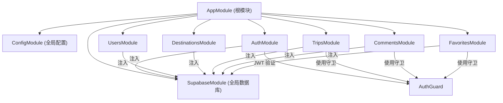

# TravelAI Backend — 技术栈与依赖说明

> **项目名称**: `travelai-backend`  
> **版本**: 0.0.1  
> **描述**: TravelAI 智能旅行规划后端服务  
> **运行端口**: 3001（可通过环境变量 `PORT` 覆盖）

---

## 目录

- [1. 技术总览](#1-技术总览)
- [2. 核心框架 — NestJS](#2-核心框架--nestjs)
- [3. 编程语言 — TypeScript](#3-编程语言--typescript)
- [4. 数据库 — Supabase (PostgreSQL)](#4-数据库--supabase-postgresql)
- [5. 认证与安全](#5-认证与安全)
- [6. 数据验证与转换](#6-数据验证与转换)
- [7. 响应式编程 — RxJS](#7-响应式编程--rxjs)
- [8. 运行时元数据 — reflect-metadata](#8-运行时元数据--reflect-metadata)
- [9. 开发工具链](#9-开发工具链)
- [10. 环境变量配置](#10-环境变量配置)
- [11. 项目模块结构](#11-项目模块结构)
- [12. 数据库表结构概览](#12-数据库表结构概览)
- [13. 依赖版本速查表](#13-依赖版本速查表)

---

## 1. 技术总览

```
┌──────────────────────────────────────────────────┐
│                  TravelAI Backend                │
├──────────────────────────────────────────────────┤
│  Framework : NestJS v11 (Express 适配器)          │
│  Language  : TypeScript 5.8                       │
│  Database  : Supabase (PostgreSQL, BaaS)          │
│  Auth      : JWT + bcrypt                         │
│  Validation: class-validator + class-transformer  │
│  Runtime   : Node.js (ES2021 target)              │
└──────────────────────────────────────────────────┘
```

---

## 2. 核心框架 — NestJS

| 包名 | 版本 | 用途 |
|------|------|------|
| `@nestjs/core` | ^11.0.0 | NestJS 核心运行时，提供依赖注入 (DI)、模块系统、生命周期钩子 |
| `@nestjs/common` | ^11.0.0 | 常用装饰器（`@Controller`, `@Injectable`, `@Module`）、管道、守卫、异常过滤器 |
| `@nestjs/platform-express` | ^11.0.0 | 基于 Express.js 的 HTTP 适配器，处理请求/响应 |
| `@nestjs/config` | ^4.0.0 | 环境变量管理模块，支持 `.env` 文件加载、全局配置注入 |

### 在项目中的使用方式

- **模块化架构**：通过 `@Module()` 装饰器将应用划分为 `AuthModule`、`UsersModule`、`TripsModule`、`DestinationsModule`、`CommentsModule`、`FavoritesModule` 等独立模块
- **全局配置**：`ConfigModule.forRoot({ isGlobal: true })` 在根模块中注册，使 `ConfigService` 在任意模块中均可注入使用
- **全局管道**：`main.ts` 中通过 `app.useGlobalPipes(new ValidationPipe({ whitelist: true, transform: true }))` 启用自动请求体验证
- **CORS**：通过 `app.enableCors()` 开启跨域支持，当前允许所有来源（`origin: '*'`）

---

## 3. 编程语言 — TypeScript

| 包名 | 版本 | 用途 |
|------|------|------|
| `typescript` | ^5.8.2 | TypeScript 编译器，将 `.ts` 源码编译为 JavaScript |

### TypeScript 编译配置 (`tsconfig.json`)

| 配置项 | 值 | 说明 |
|--------|---|------|
| `target` | ES2021 | 编译目标为 ES2021，支持 optional chaining、nullish coalescing 等特性 |
| `module` | commonjs | 模块系统使用 CommonJS（Node.js 默认模块规范） |
| `emitDecoratorMetadata` | true | 发射装饰器元数据，NestJS 依赖注入的必要配置 |
| `experimentalDecorators` | true | 启用实验性装饰器语法（NestJS 必须） |
| `outDir` | ./dist | 编译输出目录 |
| `incremental` | true | 增量编译，提升构建速度 |
| `sourceMap` | true | 生成 source map，方便调试 |
| `strictNullChecks` | false | 未开启严格空值检查 |

---

## 4. 数据库 — Supabase (PostgreSQL)

| 包名 | 版本 | 用途 |
|------|------|------|
| `@supabase/supabase-js` | ^2.49.0 | Supabase JavaScript 客户端 SDK，提供对 PostgreSQL 数据库的 CRUD 操作 |

### 在项目中的使用方式

- **全局模块注入**：通过自定义 `SupabaseModule`（`src/config/supabase.module.ts`）使用工厂模式创建 `SupabaseClient` 实例，以 `SUPABASE_CLIENT` token 全局注入到各业务 Service 中
- **数据访问模式**：各 Service（如 `TripsService`、`AuthService`）通过 `@Inject(SUPABASE_CLIENT)` 获取客户端实例，使用链式 API 进行数据库查询

```typescript
// 示例：SupabaseModule 工厂模式注入
@Global()
@Module({
  providers: [{
    provide: SUPABASE_CLIENT,
    useFactory: (configService: ConfigService): SupabaseClient => {
      return createClient(
        configService.get<string>('SUPABASE_URL'),
        configService.get<string>('SUPABASE_KEY'),
      );
    },
    inject: [ConfigService],
  }],
  exports: [SUPABASE_CLIENT],
})
export class SupabaseModule {}
```

### 数据库特性

- **UUID 主键**：所有表使用 `uuid_generate_v4()` 生成 UUID 作为主键
- **JSONB 存储**：`trips` 表的 `itinerary_data` 字段使用 JSONB 类型存储行程数据
- **行级安全 (RLS)**：所有表已启用 Row Level Security，通过 `service_role` 策略允许后端完全访问
- **外键级联删除**：相关联表使用 `ON DELETE CASCADE` 策略

---

## 5. 认证与安全

### 5.1 密码哈希 — bcrypt

| 包名 | 版本 | 用途 |
|------|------|------|
| `bcrypt` | ^5.1.1 | 基于 Blowfish 的密码哈希算法，提供单向加密和比对能力 |
| `@types/bcrypt` | ^5.0.2 | bcrypt 的 TypeScript 类型定义（devDependency） |

**使用场景**：
- 注册时使用 `bcrypt.hash(password, 10)` 对密码进行 10 轮 salt 哈希
- 登录时使用 `bcrypt.compare(plainPassword, hashedPassword)` 比对密码

### 5.2 令牌认证 — JSON Web Token (JWT)

| 包名 | 版本 | 用途 |
|------|------|------|
| `jsonwebtoken` | ^9.0.2 | JWT 签发与验证库 |
| `@types/jsonwebtoken` | ^9.0.9 | JWT 的 TypeScript 类型定义（devDependency） |

**使用场景**：
- **签发**：`jwt.sign({ sub: userId }, JWT_SECRET, { expiresIn: '7d' })` — 令牌有效期 7 天
- **验证**：`jwt.verify(token, JWT_SECRET)` — 提取 payload 中的 `sub`（用户 ID）
- **路由守卫**：自定义 `AuthGuard` 实现 `CanActivate` 接口，从 `Authorization: Bearer <token>` 头中提取并验证 JWT，将 `userId` 挂载到 `request` 对象

---

## 6. 数据验证与转换

| 包名 | 版本 | 用途 |
|------|------|------|
| `class-validator` | ^0.14.1 | 基于装饰器的请求数据验证（`@IsEmail`, `@IsString`, `@MinLength`, `@IsInt`, `@Min`, `@Max`, `@IsOptional`） |
| `class-transformer` | ^0.5.1 | 将普通对象转换为类实例，配合 `ValidationPipe` 的 `transform: true` 使用 |

### DTO（数据传输对象）清单

| DTO 类 | 文件路径 | 字段 |
|--------|---------|------|
| `RegisterDto` | `src/auth/dto/auth.dto.ts` | `email`（@IsEmail）、`password`（@MinLength(6)）、`name`（@IsString） |
| `LoginDto` | `src/auth/dto/auth.dto.ts` | `email`（@IsEmail）、`password`（@IsString） |
| `CreateTripDto` | `src/trips/dto/create-trip.dto.ts` | `destination`（@IsString）、`duration`（@IsInt, 1-30）、`budget`（@IsString）、`vibe`（@IsString）、`title?`（@IsOptional） |

### 全局验证管道配置

```typescript
app.useGlobalPipes(new ValidationPipe({
  whitelist: true,   // 自动剥离 DTO 中未定义的属性
  transform: true,   // 自动将请求体转换为对应的 DTO 类实例
}));
```

---

## 7. 响应式编程 — RxJS

| 包名 | 版本 | 用途 |
|------|------|------|
| `rxjs` | ^7.8.1 | 响应式编程库，NestJS 的核心依赖，用于拦截器、守卫返回值等场景 |

> RxJS 是 NestJS 框架的底层依赖。在本项目中主要作为 NestJS 内部机制的支撑库，当前业务代码未直接使用 Observable 模式。

---

## 8. 运行时元数据 — reflect-metadata

| 包名 | 版本 | 用途 |
|------|------|------|
| `reflect-metadata` | ^0.2.2 | 为 TypeScript 装饰器提供运行时反射元数据能力，NestJS 依赖注入系统的基础设施 |

> 这是 NestJS 正常工作的**必备**依赖。配合 `tsconfig.json` 中的 `emitDecoratorMetadata: true` 使用。

---

## 9. 开发工具链

| 包名 | 版本 | 用途 |
|------|------|------|
| `@nestjs/cli` | ^11.0.0 | NestJS 命令行工具，提供 `nest build`、`nest start`、`nest generate` 等命令 |
| `@nestjs/schematics` | ^11.0.0 | NestJS 代码生成器，支持通过 CLI 脚手架生成 module / controller / service 等文件 |
| `@types/express` | ^5.0.0 | Express.js 的 TypeScript 类型定义 |
| `@types/node` | ^22.14.0 | Node.js 核心模块的 TypeScript 类型定义 |

### NPM Scripts

| 命令 | 说明 |
|------|------|
| `npm run build` | 使用 `nest build` 编译 TypeScript 代码到 `dist/` 目录 |
| `npm run start` | 使用 `nest start` 启动应用 |
| `npm run start:dev` | 使用 `nest start --watch` 开启开发模式（文件变更自动重启） |
| `npm run start:prod` | 使用 `node dist/main` 运行生产构建产物 |

### NestJS CLI 配置 (`nest-cli.json`)

```json
{
  "collection": "@nestjs/schematics",  // 使用 NestJS 官方 schematics 进行代码生成
  "sourceRoot": "src",                 // 源码根目录
  "compilerOptions": {
    "deleteOutDir": true               // 每次构建前清理 dist/ 目录
  }
}
```

---

## 10. 环境变量配置

项目通过 `.env` 文件管理敏感配置，由 `@nestjs/config` 的 `ConfigModule` 加载：

| 变量名 | 说明 | 示例值 |
|--------|------|--------|
| `SUPABASE_URL` | Supabase 项目 URL | `https://your-project.supabase.co` |
| `SUPABASE_KEY` | Supabase 匿名/服务角色密钥 | `your-anon-or-service-role-key` |
| `JWT_SECRET` | JWT 签名密钥 | `travelai-jwt-secret-change-in-production` |
| `PORT` | 服务监听端口 | `3001` |

---

## 11. 项目模块结构

```
src/
├── main.ts                          # 应用入口：创建实例、配置 CORS / ValidationPipe、启动监听
├── app.module.ts                    # 根模块：注册 ConfigModule 及所有业务模块
├── config/
│   └── supabase.module.ts           # Supabase 客户端全局模块（工厂模式注入）
├── auth/
│   ├── auth.module.ts               # 认证模块
│   ├── auth.controller.ts           # 认证控制器（注册 / 登录接口）
│   ├── auth.service.ts              # 认证服务（密码哈希、JWT 签发与验证）
│   ├── auth.guard.ts                # JWT 路由守卫（Bearer Token 验证）
│   └── dto/
│       └── auth.dto.ts              # RegisterDto / LoginDto
├── users/
│   ├── users.module.ts              # 用户模块
│   ├── users.controller.ts          # 用户控制器（用户信息 CRUD）
│   └── users.service.ts             # 用户服务
├── destinations/
│   ├── destinations.module.ts       # 目的地模块
│   ├── destinations.controller.ts   # 目的地控制器（浏览 / 搜索目的地）
│   └── destinations.service.ts      # 目的地服务
├── trips/
│   ├── trips.module.ts              # 行程模块
│   ├── trips.controller.ts          # 行程控制器（创建 / 查看行程）
│   ├── trips.service.ts             # 行程服务（含 Mock AI 行程生成）
│   └── dto/
│       └── create-trip.dto.ts       # CreateTripDto
├── comments/
│   ├── comments.module.ts           # 评论模块
│   ├── comments.controller.ts       # 评论控制器
│   └── comments.service.ts          # 评论服务
└── favorites/
    ├── favorites.module.ts          # 收藏模块
    ├── favorites.controller.ts      # 收藏控制器
    └── favorites.service.ts         # 收藏服务
```

### 模块关系图



---

## 12. 数据库表结构概览

数据库 Schema 定义在 `supabase/migration.sql` 中：

| 表名 | 说明 | 主要字段 |
|------|------|----------|
| `users` | 用户表 | `id`(UUID), `email`, `password_hash`, `name`, `avatar_url`, `bio` |
| `categories` | 目的地分类表 | `id`(UUID), `name`, `icon`, `sort_order` |
| `destinations` | 目的地表 | `id`(UUID), `name`, `location`, `image_url`, `rating`, `category`, `is_trending` |
| `trips` | 行程表 | `id`(UUID), `user_id`(FK→users), `destination`, `duration`, `budget`, `vibe`, `itinerary_data`(JSONB) |
| `favorites` | 收藏表 | `id`(UUID), `user_id`(FK→users), `trip_id`(FK→trips), UNIQUE(user_id, trip_id) |
| `comments` | 评论表 | `id`(UUID), `user_id`(FK→users), `trip_id`(FK→trips), `content`, `likes` |

### 索引

| 索引名 | 表 | 字段 |
|--------|---|------|
| `idx_destinations_category` | destinations | category |
| `idx_destinations_trending` | destinations | is_trending |
| `idx_trips_user_id` | trips | user_id |
| `idx_favorites_user_id` | favorites | user_id |
| `idx_favorites_trip_id` | favorites | trip_id |
| `idx_comments_trip_id` | comments | trip_id |

---

## 13. 依赖版本速查表

### 生产依赖 (`dependencies`)

| 包名 | 版本 | 分类 |
|------|------|------|
| `@nestjs/common` | ^11.0.0 | 核心框架 |
| `@nestjs/core` | ^11.0.0 | 核心框架 |
| `@nestjs/platform-express` | ^11.0.0 | HTTP 适配器 |
| `@nestjs/config` | ^4.0.0 | 配置管理 |
| `@supabase/supabase-js` | ^2.49.0 | 数据库客户端 |
| `bcrypt` | ^5.1.1 | 密码哈希 |
| `jsonwebtoken` | ^9.0.2 | JWT 认证 |
| `reflect-metadata` | ^0.2.2 | 装饰器元数据 |
| `rxjs` | ^7.8.1 | 响应式编程 |
| `class-validator` | ^0.14.1 | 数据验证 |
| `class-transformer` | ^0.5.1 | 数据转换 |

### 开发依赖 (`devDependencies`)

| 包名 | 版本 | 分类 |
|------|------|------|
| `@nestjs/cli` | ^11.0.0 | CLI 工具 |
| `@nestjs/schematics` | ^11.0.0 | 代码生成 |
| `@types/bcrypt` | ^5.0.2 | 类型定义 |
| `@types/express` | ^5.0.0 | 类型定义 |
| `@types/jsonwebtoken` | ^9.0.9 | 类型定义 |
| `@types/node` | ^22.14.0 | 类型定义 |
| `typescript` | ^5.8.2 | 编译器 |

---

*文档生成时间：2026-02-17*
